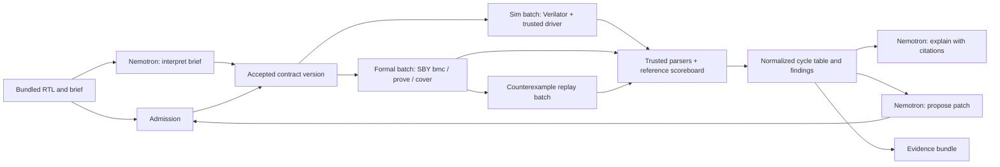

# Architecture

This describes the implemented local system. Hosted deployment and Nebius Serverless Jobs are not implemented; see [status](STATUS.md).

| Component | Location | Responsibility | Boundary |
| --- | --- | --- | --- |
| Web interface | `apps/web` | Contract review, findings, explanation, repair/export, audit | Presents recorded evidence and honest run states; no verdict logic |
| Control service | `src/countertrace/server.py`, `runs.py` | Run state, queue (one active run, up to two worker batches), cancellation, model calls, artifact ownership | Holds model credentials; owns every command line |
| Contract and reference model | `contract.py` | Versioned contract document and hash; independent reference queue implementing the sampling convention | Hand-authored; never imports DUT or model output |
| Admission | `admission.py` | Size, encoding, subset, interface, and prohibited-construct checks before execution; elaborated-port check after | Applied identically to bundled, owner, and model-generated source |
| Runner | `runner.py` | Prepares read-only job directories and launches the container | `--network none`, read-only root, `--cap-drop ALL`, no-new-privileges, CPU/memory/PID limits, empty environment |
| Worker | `verifier/worker.py` (in image) | Validates `job.json`, runs Yosys, Verilator, and SBY with fixed arguments, writes raw artifacts | No pass/fail decisions; cannot receive commands or harness files from the job |
| Trusted harness | `verifier/harness/` | Simulation driver (records post-edge outputs) and formal monitor (reference queue, 3 assertions, 1 assumption, 12 covers) | Authored independently of DUTs and repairs; hashed and compared on every batch |
| Scoreboard and parsers | `scoreboard.py`, `formal.py` | Score traces against the reference, first-mismatch findings, coverage, SBY status/log/VCD parsing, property inventory | Malformed, truncated, or inconsistent evidence is a tool error |
| Verification pipeline | `verify.py` | Simulation and formal batches in parallel, integrity checks, obligations, counterexample normalization and replay | Method-specific statuses only |
| Audit | `audit.py` | Fault library vs. named supplemental check set | Core decides validity; never a confidence score |
| Repair | `repair.py` | Up to three candidates, re-admission, child-run verification, frozen-set comparison | Only DUT source may change |
| Model client | `model.py` | Nemotron via Nebius Token Factory: interpretation, explanation, repair | Token caps required, schema validation, citation checks, usage ledger |
| Evidence | `bundle.py` | Report, manifest, inputs, artifacts; replay | Hashes identify content; they do not establish authorship or soundness |

## Data flow

## Cycle convention

Cycle k is a rising edge. The simulation driver sets inputs while the clock is low, raises the clock, waits for settling, and records outputs. The scoreboard decides accepted operations from the reference queue before the edge. In the formal monitor, solver step t applies the inputs at step t to edge t, and outputs at step t are the post-edge values of edge t−1, so assertions at step t check application cycle t−1 and are guarded by `past_valid`. `formal.counterexample_observations` pairs inputs at step k with outputs at step k+1. Unit tests check the mapping against a real solver trace, and every survey counterexample was reproduced by simulation at the same cycle and check.

## Frozen check set

Each verification records `frozen`: the contract hash, harness file hashes, verifier digest, stimulus version and per-test hashes, limits, formal tasks, and expected property counts. A repair candidate is judged only if its `frozen` equals the parent's; replay refuses a bundle whose harness or stimulus differs from the checkout.

## Result integrity

Simulation passed, no counterexample within a horizon, and unbounded proof are different claims. When one property fails, the solver stops and the remaining properties are reported unresolved. Unknown, timeout, unsupported, cancelled, tool error, and missing evidence stay explicit. A model answer, zero exit code, or completed container is never a pass.

A supplemental check set names the frozen-suite tests it observes and the reviewed check templates it applies. Its kill count is reported for that set only.

## Not yet implemented

Hosted deployment, Nebius Serverless Jobs, model-proposed supplemental checks, a port-name mapping, depth 8, public uploads, and per-visitor run limits beyond the single active-run queue.
