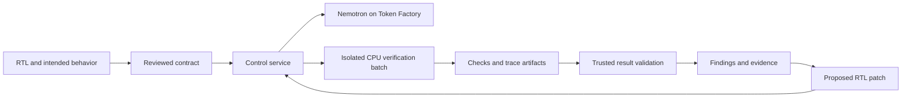

# Countertrace PRD

**Version:** 1.2 · **Date:** October 5, 2026 · **Status:** Education is the primary product direction. The verification engine and recorded model repairs have run; learning outcomes remain unmeasured. See repository STATUS.md for current execution evidence.

Countertrace is an interactive hardware debugging lab for digital-design students, instructors, and FPGA club mentors. Learners predict behavior, construct a short experiment, inspect an actual counterexample, and explain what their evidence establishes. The first release supports one synchronous FIFO contract and reusable lessons on overflow, simultaneous operations, and evidence limits. The existing verification workbench remains available for diagnosis, model-proposed repair, and reproducible evidence export. Public arbitrary uploads and user testbench ingestion remain deferred. The project was built from scratch; historical AKILI code is not a dependency.

The recommended entry is in Coding and Agentic Engineering. The submission deadline is October 30, 2026 at 1:00 p.m. EDT. The working project must remain available for judging through December 15, 2026. These dates and the requirement to use an NVIDIA open model with Nebius come from the [official rules](https://nebiusglobalaihackathon.devpost.com/rules).

Coding and Agentic Engineering remains the recommended track: learners investigate executable RTL and inspect NVIDIA Nemotron interpretations, explanations, and independently checked repairs. The education workflow adds advisory coaching through Nebius Token Factory in the configured local build. Hardware subject matter alone does not make this Physical AI. All four judging criteria are equally weighted. Educational positioning does not establish impact without observed learner usefulness.

## Product decision

Commit to one learning journey: read a fixed contract → commit a prediction → build a short test sequence → compare expected and observed behavior → explain the evidence → answer a transfer question → export a practice record. The instructor journey is choose a lesson → share its link → facilitate experiments → review voluntarily shared anonymous practice records.

The distinctive product hypothesis is that constructing counterexamples helps learners challenge plausible hardware fixes and recognize the limits of passing tests. The learning lab is the primary experience. A passing sequence is not complete correctness, and a practice score is not a learning gain. The existing check-quality audit and real Nemotron repair records support advanced discussion. Agentic RTL repair, educational HDL exercises, formal verification, and mutation testing have precedents; make no first-of-kind research claim.

Keep the scope narrow: one fixed FIFO contract, three reusable lessons, a finite set of recorded experiments, and optional live advisory coaching. The verification workbench retains eligible RTL input in the local build. Generic SystemVerilog support, arbitrary public uploads, course catalogs, accounts, grading automation, and LMS integrations are deferred.

## Audience and problem

Learners understand clocks, reset, and basic RTL but need practice choosing revealing inputs and explaining why a result supports a conclusion. The initial activities use small synchronous queues. They practice boundary behavior, causal reasoning, and scoped evidence; the product does not claim to assess their existing testbenches.

Learners should answer: What do I predict? Which sequence would test that prediction? Where do expected and observed behavior diverge? What does the result establish, and what remains unchecked? Instructors should be able to run a lesson without assembling their own simulator environment, then inspect actual answers, attempts, and assistance.

Instructors and FPGA club mentors are the primary facilitators and adoption audience; digital-design students and junior FPGA developers are the learners. Commercial hardware teams remain a future audience requiring broader language support and different privacy, integration, and sign-off capabilities.

The need and willingness to adopt this workflow are hypotheses. No interviews, endorsements, time savings, or pilot results are claimed in this PRD.

## What success means

The education release succeeds when a learner can complete prediction, investigation, explanation, and transfer, and an instructor can reuse the lesson and inspect exported practice records. Completion means the activity was completed; it must not imply mastery. Proposed pilot target: at least two of three observed learners identify the governing rule and answer a related transfer case, with assistance and failed attempts disclosed. This small sample cannot establish general learning gains. The following engineering targets remain verification-workbench regression targets; they are not educational efficacy measures.

Proposed launch targets are:

| Outcome | Acceptance target |
| --- | --- |
| Reliable diagnosis | Reproduce at least 6 of 8 faulty cases in the frozen evaluation suite, spanning at least four defect classes. Show every attempted case. |
| Honest conclusions | No faulty case is classified as satisfying the selected contract; no reproducible defect is falsely reported on four correct controls. Unknowns and errors remain visible. |
| Useful repair | At least 5 of 8 faulty cases receive an independently checked successful repair within three candidate attempts. Report both all-case and attempted-repair denominators. |
| Formal evidence | At least one nontrivial data-ordering or transaction-accounting property receives an unbounded proof for a supported configuration, with assumptions and reachability evidence. |
| Reproducibility | Three representative evidence bundles reproduce their check outcomes on a clean environment, twice each. Identical model text, timings, and log bytes are not required. |
| Usability | In a proposed three-person study, at least two complete the principal journey and correctly explain the difference between simulation and proof. Expand to five participants if possible. Report assistance and sample limits. |
| Model contribution | On four independently authored ambiguous or conflicting briefs, detect at least three material issues and silently accept no conflict. On four clear compatible briefs, let at least three proceed without a false blocking conflict. Trace explanations must cite actual signals/cycles. Score interpretation, explanation, and repair separately from deterministic bug detection. |
| Audit usefulness | In the three-person pilot, at least two participants identify the missing requirement after seeing a supplemental-check audit and recognize the same omission in a different example. Report assistance and failures; do not infer population-level learning gains. |
| First useful experience | Provisional targets: open a recorded evidence-backed example within 5 seconds and show a useful live finding within 120 seconds on the declared bundled configuration. Measure cold and warm runs separately before publishing a latency promise. Full repair completion is reported separately. |

These are release targets, not measured performance or guarantees. Failure to meet them triggers a smaller product or a narrower claim. Zero observed errors on a small suite does not establish a general error rate of zero.

The primary hackathon experience is now the education release described above. The verification workbench retains two engineering profiles: diagnosis with audit and export, or full diagnosis plus independently checked repair. Real repair evidence may be shown only with its exact frozen checks and outcomes. Educational activities must remain usable without paid learner credentials. Recorded replay, live inference, and live RTL execution must remain visibly distinct. Decide the maintained workbench profile by October 14; no change to evidence or isolation requirements is implied by the education direction.

## Supported hardware contract

The initial supported family is a bounded synchronous FIFO: a queue in which accepted items leave once and in order. Use one top module, one positive-edge clock, and synchronous active-high reset. Start with 8-bit words and depths 2 and 4. Depth 8 is optional after solver measurements. Each result applies only to the exact instantiated parameters.

The proposed canonical interface is `clk`, `rst`, `wr_en`, `rd_en`, `din`, `dout`, `full`, and `empty`. A validated port-name mapping is permitted; arbitrary adapter code is not. Maximum uploaded input is one UTF-8 RTL file, 64 KiB and 500 nonblank lines, with no external dependencies. These limits are admission rules, not claims about tool capacity.

The first contract profile deliberately fixes the following semantics:

| Condition | Required behavior |
| --- | --- |
| Reset asserted at a rising edge | Reset wins over read and write. Occupancy becomes zero. `empty` is true and `full` is false after the edge. |
| Write requested while not full | Accept one input word. |
| Read requested while not empty | Remove the oldest word. `dout` contains that word after the edge; it is meaningful for that accepted read. |
| Read requested while empty | Ignore the read. Do not consume or bypass a simultaneous new write. |
| Write requested while full | Ignore the write, including when a simultaneous read frees a slot. |
| Both requested between empty and full | Accept both. Occupancy stays constant; the old head is read and the new word joins the tail. |
| Both requested while empty | Accept only the write. |
| Both requested while full | Accept only the read. |
| Wraparound | Preserve accepted-word ordering and capacity across pointer wraparound. |

Acceptance decisions come from the independent reference queue's occupancy, not from trusting the DUT's `full` or `empty` outputs. The flags are themselves checked against the reference state. No requirement is imposed on `dout` when there is no accepted read; uninitialized data must not be turned into a spurious defect.

Natural-language input is used to identify intended behavior and conflicts with this profile. Unspecified behavior is shown as a concrete decision for the user. A request for fall-through reads, full-capacity exchange, asynchronous reset, or another unsupported policy produces an explicit unsupported-profile result rather than silently changing the intent.

The contract records the initial reset sequence, subsequent reset behavior, sampling convention, and every environment assumption. Reset may recur after initialization and must be tested. No assumption may constrain DUT outputs to force a desired result. The initial release checks a two-state digital model; it does not establish X-propagation behavior, timing closure, electrical behavior, or correctness of a synthesized device.

**Sampling convention.** Cycle k names a rising edge. Drive requests, data, and reset while the clock is low and hold them stable through that edge. Decide accepted operations from the reference queue immediately before the edge. At the edge, reset has priority; otherwise remove the pre-edge head for an accepted read and append the input for an accepted write. Check flags against post-edge occupancy and compare registered `dout` only for an accepted read, after sequential and combinational updates settle. Assert reset for the first sampled edge; make no pre-reset state claim. Later reset pulses are legal and tested.

The following depth-2 sequence defines examples to turn into shared timing fixtures. A, B, C, and D are distinct 8-bit values; queues are shown oldest first. These are specified expectations, not executed results.

| Edge | Pre-edge queue | rst | wr_en | rd_en | din | Accepted operation | Post-edge queue | Checked dout | Post-edge empty / full |
| --- | --- | --- | --- | --- | --- | --- | --- | --- | --- |
| 0 | Unspecified | 1 | 1 | 1 | A | Reset only | [] | Not checked | 1 / 0 |
| 1 | [] | 0 | 1 | 1 | A | Write only | [A] | Not checked | 0 / 0 |
| 2 | [A] | 0 | 1 | 1 | B | Read A and write B | [B] | A | 0 / 0 |
| 3 | [B] | 0 | 1 | 0 | C | Write C | [B, C] | Not checked | 0 / 1 |
| 4 | [B, C] | 0 | 1 | 1 | D | Read B only; D ignored | [C] | B | 0 / 0 |
| 5 | [C] | 1 | 1 | 1 | D | Reset only | [] | Not checked | 1 / 0 |
| 6 | [] | 0 | 0 | 1 | A | None | [] | Not checked | 1 / 0 |

The formal monitor may observe the preceding edge's outputs on its next clocked sample. Any such offset must be explicit and history-guarded. Normalize formal and simulation traces to the same pre-edge/post-edge convention and test the mapping with these fixtures plus pointer wraparound. A raw solver step number is not assumed to equal an application cycle.

## Scope and priorities

| Priority | Included capability |
| --- | --- |
| Must ship | Hosted runnable examples and a local test build for owner-controlled RTL; exact contract review; deterministic FIFO reference checks; Verilator simulation; one SBY formal flow; counterexample replay and explanation; honest result states; evidence export. Repair and rerun are required for the primary release. |
| Must ship | A small verification-quality audit using independently reviewed seeded faults; visible handling of surviving, invalid, equivalent, and unresolved mutations. |
| Must ship | Runtime NVIDIA Nemotron inference through Nebius Token Factory; measured model use; bounded retries; cancellation; recoverable run records. |
| Preferred | CPU verification batches on Nebius Serverless Jobs, subject to account access and measured integration. |
| Stretch | Custom public file uploads after additional isolation testing; expanded/repeated evaluation; a second simple module family, depth 8, or another FIFO profile. Prioritize evaluation over breadth. |
| Deferred | Natural-language-to-arbitrary-RTL generation; user testbench ingestion; UVM; general SVA ingestion; multiple simulators; repository integrations; teams/accounts product; fine-tuning; cryptographic signing; custom agents that write their own tools. |
| Excluded from claims | SoCs, multiple clocks and CDC, asynchronous reset, liveness or fairness guarantees, analog verification, timing and PPA optimization, industrial sign-off, and all-parameter proofs. |

The product remains useful if automatic repair is cut: it can still diagnose a real failure, explain the trace, and export reproducible verification. This is the first major reduction if the schedule slips. Evidence quality, sound result labeling, and independent checks are not scope cuts.

## User experience

The learning lab is the default landing experience, with a facilitator desk and the existing verification workbench accessible separately.

**Learning bench.** Offer three lessons: overflow/data order, simultaneous operations, and evidence limits with a correct control. Collect an initial prediction before showing results. Let learners compose one to six actions (write, read, simultaneous read/write, reset). Use depth 2 and deterministic 8-bit offered values for these exercises. Each available sequence must have actually executed in the isolated RTL verifier. The hosted site may replay a finite recorded library, clearly labeling its action alphabet, horizon, original method, and provenance. No browser-computed DUT behavior may be presented as executed RTL evidence. Missing, corrupt, or mismatching library evidence is an error, never a passing result.

**Explanation and transfer.** Show the independent reference queue and sampled outputs, including the first mismatch and unobserved/unchecked values. Require a learner explanation before the transfer answer is revealed. Grade only fixed-choice answers against the contract. Free text is ungraded discussion material. Keep initial answers, experiment predictions, sequences, assistance, and transfer outcomes in downloadable local practice records. No certificate, inferred mastery, or population learning claim.

**Coaching.** Authored hint ladders remain available without model access and must be labeled as authored. In the configured local build, Nemotron can respond to the learner explanation using server-selected recorded evidence. Model output is advisory and cannot change an answer key or verification verdict. Validate structured output and cited edges, disclose inference destination, and retain bounded retries, budgets, and per-visitor rate limits. A recorded coaching example, if shown, must preserve its actual request and response and cannot impersonate a live response.

**Facilitator desk.** Provide shareable lesson routes, a suggested session plan, prerequisites, facilitator answer keys, and voluntary import of anonymous practice records. Imported files remain local to the browser, are validated and bounded, and are self-reported practice rather than independent study evidence. Report record counts, not unique participants or demonstrated gains. No outreach or collection happens automatically.

The workbench retains its three existing surfaces:

**Contract setup.** A user can immediately try a public FIFO example, or submit an eligible module in the local test build. Public upload is an optional later capability. Show the supported profile, data-processing destination, exact parameter choice, and any mismatch before launching work. Present plain-language requirements beside ports and concrete examples, especially simultaneous operations and reset. The user accepts a specific contract version. A change later creates a new baseline.

**Findings.** Show actual stages such as queued, validating, simulating, checking properties, replaying a trace, and explaining. Include elapsed time, cancellation, and completed-task counts without inventing solver progress percentages. Lead with the violated behavior and a compact cycle table: inputs, accepted operations, expected queue, observed output, and failing requirement. A small queue animation may use the actual trace; it must not invent intermediate events. Detailed waveforms, assertions, and logs are expandable. Keep the first screen focused on the failed requirement, expected versus observed behavior, and the next action. Introduce formal-verification terminology through expandable explanations.

**Repair and export.** Show a proposed source diff and the evidence that motivated it. The user can run the candidate against the unchanged contract or edit the RTL themselves. Preserve every candidate and the original failure. A repair requiring different intent becomes a new contract version, not a successful repair of the old one. Export the report and all inputs needed to reproduce deterministic checks.

Use text and icons as well as color for every state. Requirements and trace cycles must be keyboard accessible. Display a persistent unresolved count. A recorded example is labeled as a recorded run and includes its actual date, versions, and timing; a live run has separate status.

The judge journey offers an immediately inspectable recorded example with real evidence and a separate live rerun. The live route exposes the first useful finding while later obligations continue. The 45-minute safety deadline is not an interaction target. Record time to first finding and time to complete repair separately; the provisional 5-second recorded-example and 120-second live-finding targets must be measured on a named configuration.

## Result semantics and trust rules

| Result shown | Evidence required |
| --- | --- |
| Simulation passed for these runs | Successful assertion-enabled executions, named tests or seeds, and cycle counts. |
| No counterexample within N cycles | Successful bounded checking with the exact depth and assumptions. |
| Property proved under these assumptions | A successful unbounded property proof for the named property, contract, toolchain, and parameter configuration. |
| Counterexample found | A failing check and preserved trace; simulation replay status is shown separately. |
| Unresolved | Timeout, unknown, unreached bounded cover, unreproduced trace, or another incomplete obligation with a reason. |
| Tool error | Compile, worker, solver, parsing, or artifact-integrity failure. |
| Not checked or unsupported | No valid execution or outside the admitted profile. |

SymbiYosys distinguishes bounded checking, unbounded proof, and reachability; the UI must preserve those distinctions. [SBY reference](https://yosyshq.readthedocs.io/projects/sby/en/stable/reference.html)

Never infer proof from a completed cloud job, compiler success, missing assertions, or model approval. No overall percentage is labeled verified or correct. Requirement mapping, scenario reachability, and mutation results are separate measures with explicit denominators. An aggregate may say that all listed obligations are resolved, while still showing methods and limitations.

The contract, assumptions, reference monitors, promoted supplemental checks, requirement mappings, regression seeds, compiler version, and tool configuration are immutable within a repair comparison. Changes to any of them invalidate the comparison and require a new run baseline. Only DUT source can be changed by the repair agent. The user can inspect the exact assumptions underlying any result.

A formal counterexample is replayed through the independently authored simulation scoreboard where supported. A mismatch between engines is a result to investigate, not an inconvenience to hide. Reachability checks reduce particular risks of vacuous success; they do not prove that the specification is complete or correct.

## Verification and repair requirements

**Input admission.** Validate encoding, size, supported ports, parameters, syntax subset, and prohibited constructs before launching expensive work. Reject unsupported blackboxes, external includes, DPI/VPI, native extensions, user build scripts, executable system tasks, DUT-authored assumptions, and configurations that could bypass the trusted harness. Preflight diagnostics identify the unsupported construct and supported alternative where available. Apply the same admission pipeline to every model-generated repair and supplemental check, including runs that began from bundled examples. Reject interface or parameter changes, injected assumptions, and preprocessing or tool-specific constructs that make simulation and formal verification see different behavior. Model output cannot edit the harness, build policy, or command line.

**Contract compilation.** Nemotron proposes a structured contract and supplemental checks. A backend-owned compiler maps accepted fields to reviewed templates. The core FIFO simulation scoreboard and formal monitors are authored and reviewed independently of the model that repairs the DUT. Candidate model-generated checks are supplemental and cannot replace the core checks. Before promotion, validate them against reviewed correct controls and known faults, check their mapping to the contract, and obtain technical review. Failure of an unreviewed candidate is a possible issue, not an authoritative defect. Unsupported temporal syntax is rejected rather than approximated.

**Toolchain.** Pin a container with Verilator and a Yosys/SymbiYosys solver flow. Use clocked immediate assertions and explicit monitor state within the proven supported subset. The free Yosys frontend and Verilator have language/assertion limits; unrestricted SystemVerilog Assertions are not an MVP dependency. [Yosys language support](https://yosyshq.readthedocs.io/projects/yosys/en/latest/using_yosys/verilog.html), [Verilator language support](https://verilator.org/guide/latest/languages.html)

**Core obligations.** Check reset state, occupancy bounds, accepted-transaction accounting, full/empty flags, ignored illegal requests, ordered data output, simultaneous operations, and wraparound. Require reachability evidence for reset release, accepted read/write, empty/full, wraparound, and each relevant simultaneous-operation case. Guard history-dependent checks before prior samples exist.

**Verification-quality audit.** Use a small, versioned fault library against a known-good implementation. Score the generated or supplemental check set separately from the mandatory core monitors, using reviewed faults such as lost occupancy updates, wrong wraparound, ignored reset, or duplicated data. The independent core establishes each fault's validity and is never removed from design acceptance. A survived fault points to a possible weakness in that named supplemental check set. A mutant may also be invalid, behaviorally equivalent, or unresolved; report those separately. Do not mutate an already faulty DUT and interpret the resulting kill score as verification quality. This is a canary audit of particular checks, not a confidence score for arbitrary RTL.

Audit candidate checks before the DUT repair stage. Adding or promoting a check creates a new checker version; rerun the original DUT and freeze the resulting bundle before comparing repairs. The demo may show an explicitly labeled weak candidate check set missing a fault, but cannot imply that the mandatory core accepted that faulty design. The primary measured benefit of this audit is exposing weak checks and helping the learner understand missing evidence; improved repair accuracy is a separate hypothesis requiring a controlled comparison. Keep the audit compact until learner evidence supports a larger surface. Ask users to name the missing requirement, then test transfer to a different example. The audit is not an assessment of their existing testbench.

**Repair.** Provide the failing contract clause, reproducible trace, and current RTL to the repair model. Accept a constrained source patch only. Limit the loop to three candidate attempts per defect/run. After each patch passes admission again, execute the full frozen check set and regression seeds. A model's explanation cannot approve a repair. If no candidate passes within budget, export the diagnosis and unsuccessful attempts.

**Error behavior.** Negative controls must cover disabled assertions, zero properties, contradictory assumptions, permanently asserted reset, unreachable preconditions, altered verifier hashes, unsupported syntax, worker crashes, solver timeouts, model schema failures, cancellation, and stale artifacts. None may produce a proof result. Bounded non-reachability must not be presented as impossibility.

## Architecture and sponsor integration

The browser talks to a small control service that owns run state, model calls, contract versions, and the job queue. A deterministic verifier executes in isolated CPU workers. The result parser is a trusted component; the model explains tool evidence after it has been recorded.

Use Ultra for the initial contract interpretation, difficult failure analysis, and repair until measurement justifies a smaller model. Evaluate Super on the same development cases before routing suitable work to it. Nano is optional; adding three models is not a success criterion. Exact available model IDs, schema behavior, quotas, and prices must be checked against the actual account before implementation commitments. No fine-tuning is required.

Nemotron has three measured responsibilities: flag material intent conflicts without blocking clear compatible briefs; explain a recorded counterexample using correct signal and cycle references; and, in the primary release, propose a source patch that passes unchanged independent checks within budget. The deterministic checker owns detection and acceptance. Report model task outcomes independently so its contribution cannot be confused with the core monitor's success.

Nebius Token Factory runtime calls satisfy the hosting/model integration route in the rules. Serverless Jobs provide useful batch execution but are not required for eligibility. If Jobs access blocks progress, use the same pinned verifier on available isolated CPU compute while retaining runtime Nemotron calls; document which Nebius services actually ran.

Use one Job per candidate verification batch, with limited internal parallelism for seeds, configurations, and faults. Do not create one cloud Job per tiny simulation. Repair candidates may require additional batches. Benchmark-only batches can group multiple cases to amortize startup.

Nebius documents CPU-capable Jobs, startup that can take minutes, and a minimum configurable cloud timeout of one hour. Application-enforced subprocess and run limits must therefore be much shorter. That timeout minimum is not a claim about minimum billing duration. Record provisioning, tool execution, and model latency separately. [Jobs management](https://docs.nebius.com/serverless/jobs/manage)

The initial implementation preference is a new Python control service and worker harness, a lightweight TypeScript web interface, durable run metadata, and object/file storage for artifacts. Start with a fresh repository and implementation. Avoid introducing multiple orchestration frameworks for a single bounded loop.

## Execution limits and data handling

Initial proposed limits are one active run per visitor, two active worker batches per deployment, three repair attempts, 60 seconds per compilation, 120 seconds per solver task, and 15 minutes of worker execution per candidate batch. The 45-minute total workflow deadline includes queueing, compilation, model calls, and all repair batches, and overrides every per-stage allowance. A third repair is not guaranteed time to run. At the global limit, preserve collected evidence, terminate remaining work, and mark unfinished obligations unresolved. These limits protect resources; they are not the promised time to first useful result. If provisioning prevents the live-finding target, measure a warm isolated CPU runner or reduce the interactive batch before widening scope.

Initial worker targets are 4 vCPUs, 8 GiB memory, 128 processes, 1 MiB per log, 8 MiB per trace, and 32 MiB per exported bundle, subject to available presets and measurement. Indicate any truncation; missing required evidence prevents a complete result. Model input/output-token caps and a deployment spend cap must be explicitly configured before a hosted run. These are proposed safeguards, not tested capacities.

Track actual model usage and compute cost separately; unknown billing information is labeled unavailable, not zero. Serverless Jobs use Compute pricing and quotas, with possible separate storage costs. [Nebius pricing and quotas](https://docs.nebius.com/serverless/pricing-quotas)

Compilation and simulation process executable inputs. Workers run without application/model secrets, with a read-only verifier, per-run scratch space, a nonprivileged process, resource limits, and blocked child-process network access including cloud metadata. The trusted control layer owns commands and uploads capped artifacts. No prompt, model-generated candidate, or user-supplied file can alter the tool policy, container, shell command, or verifier configuration.

Public custom uploads are enabled only after isolation is tested. Before that, public access is limited to bundled examples and an accurately described recorded run; a local test build can support owner-controlled files. Report this limitation in the submission instead of presenting curated examples as arbitrary-input support.

Tell users before submission that RTL, the contract, and relevant diagnostics are sent to Nebius for inference/execution as applicable. Do not promise suitability for confidential commercial designs. Public demo runs contain only licensed public or team-owned examples. Custom inputs are private by default, excluded from public benchmark exports, and deletable. Proposed retention is seven days for custom runs; preserve separately consented judging fixtures through the judging period. Do not publish full uploaded source or private model context in operational logs.

The supplied judging route is free to use and must not require judges to buy credits or provide a paid API key. Fund inference and compute through December 15, preserve a tested release and fixtures, and verify access without the owner's session. Keep a clear working test-build route if hosted execution is unavailable; recorded output alone does not replace the working project. Before submission, record operating ownership, spending limits, credit expiry, service availability checks, and a recovery procedure. Public traffic must not exhaust the capacity needed for judging.

## Evidence bundle

Every run produces a readable report and a machine-readable manifest. The report starts with the intended behavior, finding, method, and unresolved items. The manifest binds the exact DUT, contract, monitor/harness, assumptions, parameters, container digest, tool versions, commands, seeds, bounded depths, model identifiers, usage, timestamps, and parent/candidate relationships.

Include raw tool logs, result files, counterexample waveforms, a normalized cycle table, patch diffs, and instructions to replay the deterministic checks without making another model call. Capture which checks were omitted or terminated. Parse authoritative tool result artifacts and expected property counts; do not treat arbitrary text printed by the DUT as a verification result.

Content hashes identify matching inputs and artifacts. They do not establish trusted authorship or mathematical soundness. Cryptographic signing is deferred. Reproducibility means rechecking a fixed artifact with a pinned environment, not regenerating identical stochastic model output.

## Evaluation plan

Separate development fixtures, showcase examples, and a frozen evaluation suite. The required pilot is eight faulty designs and four correct controls, spanning at least two independently authored FIFO implementations within the same supported profile, with at least one implementation held out during prompt development. Different parameter values of one source are not counted as independent designs. Cover reset, flags/boundaries, simultaneous operations, and data ordering/wraparound. An expanded suite of 12 faulty designs, six controls, and three implementations is stretch scope.

Have an experienced reviewer validate the intended behavior and expected failures. Reviewer access is currently unconfirmed. If external review is unavailable, disclose that limitation and use separate hand-authored reference implementations and witnessed defects; do not describe the evaluation as externally validated.

Freeze evaluation cases before final model/prompt selection. Keep them out of development feedback. During evaluation, the repair system receives the same legitimate contract and checker diagnostics that the shipped product exposes. Separate final regression tests and ground-truth labels remain hidden from repair feedback. Once a holdout case is used to tune the system, it becomes development data and needs replacement or explicit disclosure.

The required primary-release engineering comparison is a single-model tool-feedback repair baseline versus the product workflow. Both receive the same RTL, accepted contract, mandatory core checks and diagnostics, model access, solver access, and comparable attempt/token/time budgets; both use the same hidden final evaluator. The baseline has no supplemental-check audit; the product may show audit findings and approved additional checks. Report this as a comparison of complete workflows. Changes in checks and feedback are confounders: do not attribute an improvement specifically to the audit without a separate experiment controlling those differences. An audit-only repair comparison is stretch scope.

For either release, compare the same deterministic checks and normalized trace with versus without model explanation, keeping the audit presentation fixed. Predeclare a short comprehension rubric: identify the violated requirement, locate the first failing transaction, describe the expected versus observed behavior, and state the limits of a passing result. Score each item as incorrect, partially correct, or correct; record assistance. Separately assess intent interpretation using four ambiguous/conflicting and four clear compatible briefs. In the diagnosis release these comparisons replace the repair experiment. Evaluate audit learning separately by asking users to identify a missing requirement and recognize the same omission in a different example. Do not attribute the trusted core's detection performance to the model.

Run each configuration once for the required pilot and preserve all attempts; three repeats are stretch scope. A one-run pilot cannot establish reliability across stochastic generations. Repeats test variability and do not enlarge the number of independent designs. Publish raw counts for diagnosis, false alarms, repairs, unknowns, unsupported inputs, tool errors, mutation categories, and bundle replays. Report median and range of end-to-end runtime and model/compute cost across all attempts, with queue time separate. Never publish success-only averages without identifying the denominator.

Recruit at least three advanced students or junior FPGA developers during the first week, expanding to five only within capacity. Seek a technical reviewer in parallel. Observe an early debugging session before polishing the full interface. In the final study ask each participant to find a bug, explain the failing sequence, identify the limits of a passing result, and export or replay the checks. Include the separate supplemental-check transfer question. Record completion, assistance, misunderstandings, and task time; counterbalance order and use matched examples if comparing workflows. Individual observations can demonstrate usefulness and expose confusion; this small sample cannot establish broad demand or population-level productivity gains. No participants or results are assumed.

## Build plan and decision gates

Planning reference: one builder and a 100-hour effort envelope for a new implementation. Actual availability is unconfirmed. The envelope allocates 24 hours to contract/oracle/toolchain, 12 to model integration and repair, 14 to the interface, 8 to cloud execution and run storage, 10 to audit/export, 12 to technical evaluation and review, 4 to user sessions, 8 to release/video/submission, and 8 to contingency. These are scope caps, not an estimate proven by implementation. If capacity is closer to 80 hours, select the diagnosis release early and use the alternative CPU runner if cloud integration is costly. Public custom uploads, broader hardware support, and expanded evaluation are outside this envelope. The primary release is an aggressive planning hypothesis for someone already familiar with RTL and formal tools. The 8-hour contingency is thin; after the October 4 gate, rebaseline the allocation to reserve at least 15 hours by reducing interface polish, cloud integration, and audit breadth before reducing evidence quality. Include recruitment and analysis in the study budget and fixture authorship and ground-truth review in the evaluation budget. Repair is earned scope once the diagnosis journey works.

| Dates in 2026 | Deliverable and decision |
| --- | --- |
| October 1 to 4 | Start the new repository; confirm an actual Nemotron call; pin the verifier; distinguish one correct FIFO from one reviewed fault; replay the counterexample and get a useful model response. Prepare the cycle fixtures; begin reviewer and learner recruitment. Attempt a first small proof if time permits. |
| October 5 to 8 | Establish one nontrivial proof or bounded-only scope, one unchanged-contract repair, and a CPU execution batch. Deliver a basic contract/findings interface. Measure the first-finding latency; observe an early user session and seek expert review. Make the initial diagnosis/repair profile decision. |
| October 9 to 14 | Add constrained patching, complete regression reruns, mutation canaries, evidence export, cancellation, and all negative result states. Test worker isolation before custom public uploads. |
| October 15 to 20 | Freeze the evaluation set, baseline, compatible/conflicting briefs, budgets, and comprehension rubric; run the declared comparisons and fix reliability issues. Add no new module family unless all core targets are already met. |
| October 21 to 25 | Run the proposed three-person usability study, simplify confusing evidence, test clean-environment replays, and stabilize deployment. Expand the study only within capacity. |
| October 26 to 28 | Record the demonstration, complete the public repository and README, document provenance of this new implementation and dependencies, prepare feedback and testing instructions. |
| October 29 | Submission rehearsal and final deployment checks. Preserve a tested release and judging fixtures; test free access without the owner's credentials and confirm funded inference and compute through December 15. |
| October 30 | Submit before 1:00 p.m. EDT. Keep time for upload and submission failures. |
| October 31 to December 15 | Maintain judge access and required services. Do not assume the submission can be edited after the deadline. |

The October 4 go/no-go gate requires a deterministic runner that distinguishes a known-good control from a witnessed faulty design, an accurately replayed counterexample, and a useful response from an actual authenticated Nemotron endpoint. Record inputs, commands, tool versions, latency, and remaining uncertainty. This is feasibility evidence, not a benchmark. If the gate fails, stop interface expansion and focus the available effort on the contract and verifier. Unbounded proof and automated repair remain next-stage gates.

If the oracle cannot distinguish good from bad by October 4, stop UI expansion and fix the contract/harness. If unbounded proof fails by October 8, first reduce the supported parameters; if only bounded checking is reliable, select the bounded-only scope and replace the corresponding success target. If Jobs access fails, use the alternative CPU runner. If a useful explainable failure journey is absent by October 8, commit to diagnosis and export and suspend repair work. If repair targets remain unmet by October 14, select the diagnosis release and remove repair from its acceptance criteria and video. Keep hosted uploads out of scope unless extra capacity supports tested isolation. Persistent false acceptance or an untrustworthy oracle is a release blocker for either profile.

## Demonstration and submission

Target a 2 minute 45 second public video, leaving room below the three-minute limit.

| Time | What the judge sees |
| --- | --- |
| 0:00 to 0:20 | A learner predicts what happens to the oldest word when a full queue receives a write. State the audience and fixed FIFO scope. |
| 0:20 to 1:00 | Build an ordinary passing sequence, then a boundary sequence. Label recorded simulation replay and inspect expected versus observed outputs. |
| 1:00 to 1:30 | Explain the failure. Show actual Nemotron coaching from the configured local build or an explicitly recorded response; never portray authored hints as model output. |
| 1:30 to 1:55 | Answer a related transfer question and export the practice record. Explain that free text is ungraded and the activity is not a measured learning gain. |
| 1:55 to 2:15 | Open the facilitator desk, answer key, and voluntarily imported example records labeled as demonstrations. |
| 2:15 to 2:35 | Show genuine rejected and accepted Nemotron repair evidence, unchanged checks, and method-specific limits in the underlying workbench. |
| 2:35 to 2:45 | State what has run, what remains unmeasured, and how NVIDIA and Nebius contribute. |

For the diagnosis release, replace the patch segment with a second held-out counterexample and evidence replay. For bounded-only delivery, replace the proof segment with the exact checked horizon and remaining uncertainty. The video follows the selected release profile.

Use an independently authored or appropriately licensed defect, with provenance. SBY already has a FIFO failure-and-waveform tutorial; its bug must not be presented as an original discovery. [SBY quickstart](https://yosyshq.readthedocs.io/projects/sby/en/stable/quickstart.html)

Recorded runs and edited waiting periods are explicitly labeled; retain the actual full timings in the evidence. Do not imply that a cold cloud job plus repair loop fits inside the video. The working demo must match its described capabilities and remain usable during judging.

The submission package includes a working project/test-build link, track selection, English description and testing instructions, a public licensed repository with complete source and setup guidance, public YouTube demonstration, sponsor-tool feedback, and a clear account of work performed during the submission period. This project starts from scratch; record any third-party code or examples with their licenses and provenance. These obligations come from the [official rules](https://nebiusglobalaihackathon.devpost.com/rules).

Confirm entrant age/residence eligibility, conflicts, and team representation where applicable; the PRD does not establish personal eligibility. The public repository must expose a detectable open-source license and all required assets. Test the submitted route free of charge without the owner's login, with supplied credentials if needed. Focus on overall and Coding and Agentic Engineering awards. Tavily is out of scope unless a functional runtime retrieval use case becomes necessary; do not add it solely for a bonus. Capture sponsor feedback throughout development using reproduction steps, expected/actual behavior, workaround, and suggested improvement. The rules permit one overall or track award plus one bonus per project.

## Stress test decisions

| Reviewer objection | Decision incorporated |
| --- | --- |
| The agent can verify its own misunderstanding | Human-readable contract, independent reference monitors, frozen assumptions/checkers, and visible limits on interpretation. |
| Existing research already does RTL repair | Position the product around learner comprehension, verification-quality auditing, and reproducible handoff; make no first-of-kind research claim. |
| A FIFO demonstration can be a rehearsed tutorial | Separate showcase, development, and held-out implementations; disclose provenance and all attempted outcomes. |
| A green dashboard can overstate assurance | Preserve method-specific statuses and unresolved obligations; no correctness percentage. |
| Serverless startup overwhelms small tests | Batch CPU work; measure provision and execution time separately; label recorded demonstrations. |
| The month can disappear into infrastructure | One module profile, one simulator, one formal flow, one bounded repair loop, three product surfaces. |
| Repair can game the verifier | Permit DUT edits only; verify immutable contract/configuration hashes; rerun full regressions. |
| Arbitrary uploaded code is a security boundary | Test isolation before enabling custom public inputs; curate the public mode if needed. |
| Mutation scores can be misleading | Use reviewed canaries on known-good implementations and report equivalent, invalid, timed-out, and unclassified cases separately. |
| The product claims to audit tests it never receives | State that the MVP evaluates named supplemental checks; user testbench ingestion is deferred. |
| The AI merely explains a hard-coded checker | Measure interpretation, grounded explanation, and repair separately from deterministic detection. |
| A judge cannot wait for a full solver loop | Separate immediate recorded evidence, measured live first findings, and full repair completion. |
| Audit and extra checks change together | Report workflow comparisons and avoid audit-specific causal repair claims. |
| Bundled examples seem safe but generated code is not | Reapply admission and worker isolation to every generated candidate. |

The reviews support proceeding conditionally. They do not establish technical feasibility, customer demand, or prize likelihood. The main tradeoff is deliberate breadth reduction: the release will be stronger on one small, checkable workflow than on arbitrary hardware generation.

## Open dependencies

| Dependency | Current state and next action |
| --- | --- |
| Historical AKILI | Background only; no dependency. |
| Nebius/NVIDIA | Authenticated interpretation, explanation, and repair calls recorded. Education coaching must be exercised separately; account funding through judging remains unverified. |
| Verification | Pinned isolated Docker, simulation/formal checks, and clean evidence replay have run. Results retain exact scope. |
| Education | Three bounded lessons are the delivery scope. No learner pilot or classroom adoption claimed. |
| Technical review | Assistant reviews exist; independent human review remains evidence strengthening, not an official entry requirement. |
| Hosting | Vercel serves recorded evidence. Live model/verification uses the local build; free funded judge access remains a release dependency. |
| Video | Owner records and publishes. Internal panels may assess the script as intended content, not actual footage. |

## Research references

Research was reviewed on October 1, 2026. These sources establish existing approaches and documented capabilities, not performance of the proposed product.

- [Hackathon official rules](https://nebiusglobalaihackathon.devpost.com/rules): dates, equally weighted judging criteria, platform/model integration, significant updates, and submission obligations.

- [Veri-Sure](https://arxiv.org/abs/2601.19747): existing contract-aware multi-agent RTL generation and formal verification.

- [Open-Source LLM-Driven Formal Verification](https://arxiv.org/abs/2607.28877): RTL repair feasibility work and reported failure modes.

- [GoGoTB](https://arxiv.org/abs/2607.26181): related specification-grounded verification work.

- [YosysHQ MCY](https://yosyshq.readthedocs.io/projects/mcy/en/latest/): established mutation-based checking methodology.

- [SBY reference](https://yosyshq.readthedocs.io/projects/sby/en/stable/reference.html) and [formal extensions](https://yosyshq.readthedocs.io/projects/sby/en/stable/verilog.html): property modes, result states, assumptions, and temporal primitives.

- [Verilator language support](https://verilator.org/guide/latest/languages.html): supported language and assertion limitations.

- [Nebius Jobs management](https://docs.nebius.com/serverless/jobs/manage) and [pricing and quotas](https://docs.nebius.com/serverless/pricing-quotas): batch operation and infrastructure constraints.

- [Nebius Nemotron catalog](https://nebius.com/services/token-factory/models/nvidia-nemotron-models-inference): publicly documented model offerings; confirm the selected endpoint in the actual account.

The October 1 hackathon fit review and adopted decisions are retained in `docs/reviews/hackathon-fit.md`. This record is a design assessment, not independent technical validation. Earlier reviews mentioned during PRD preparation are not included unless their original records are recovered.
